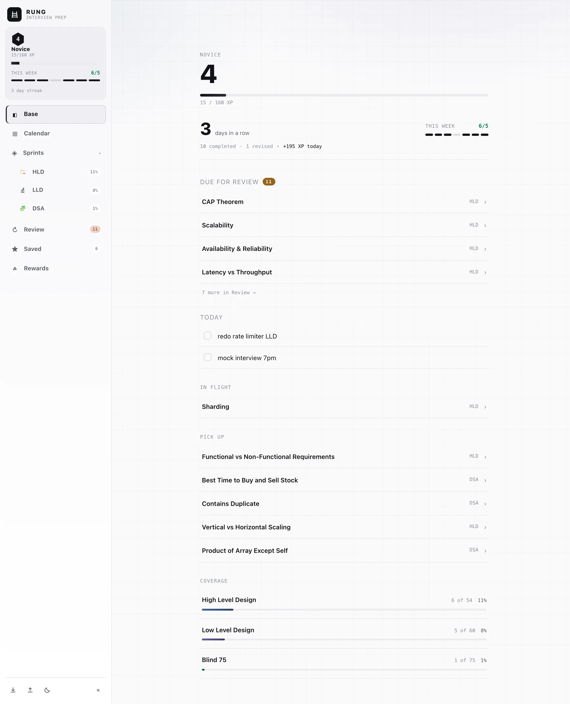
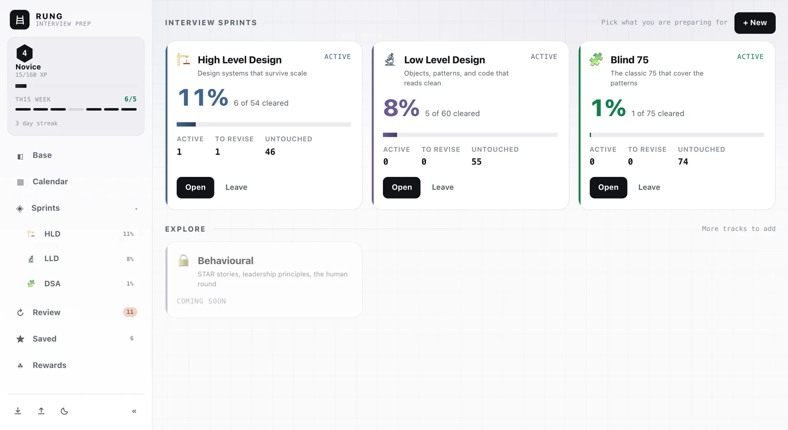
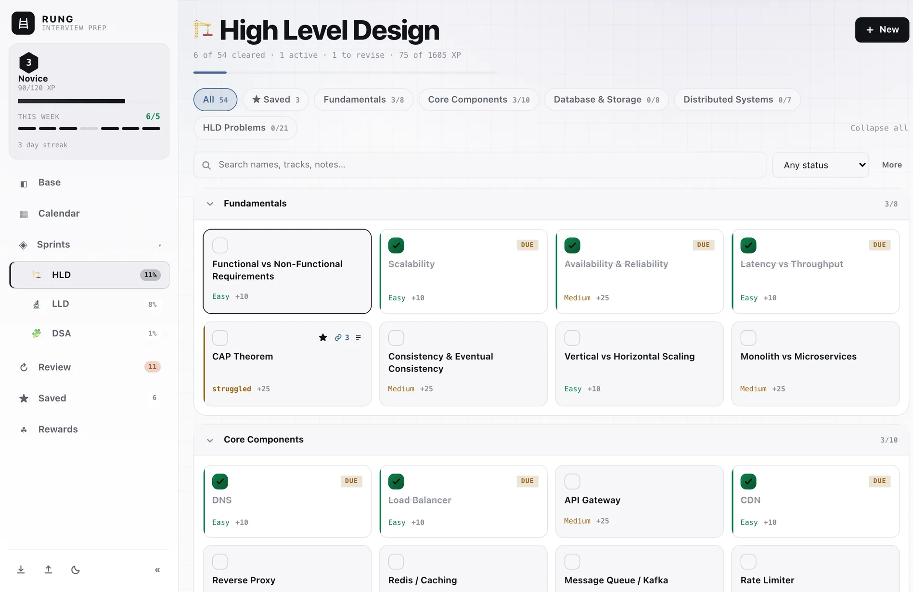
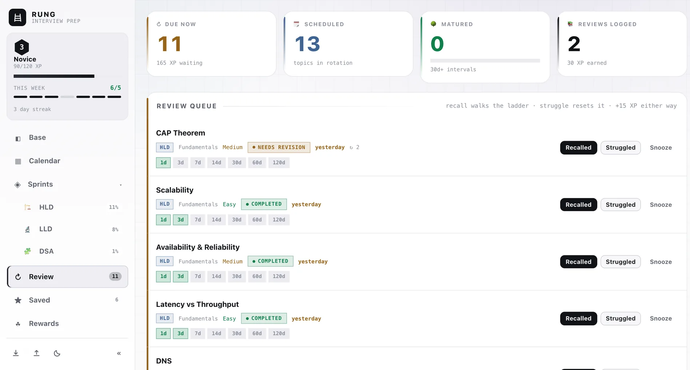
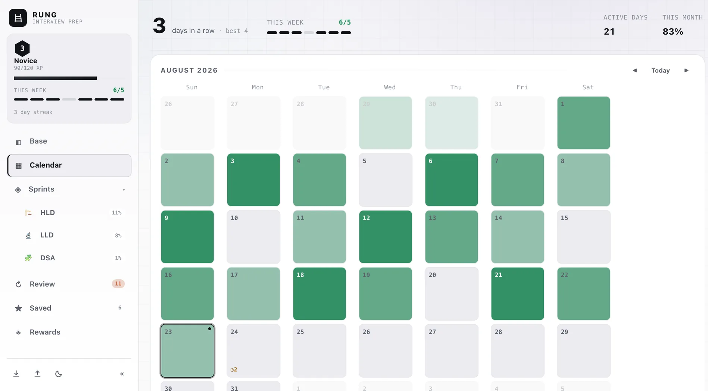
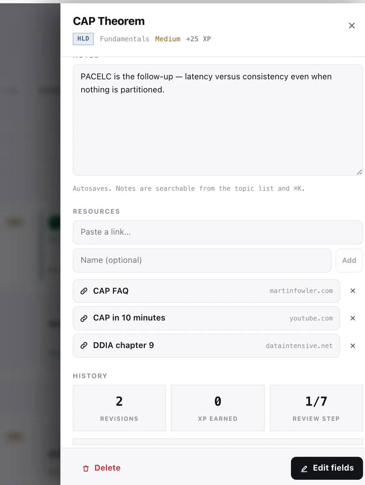
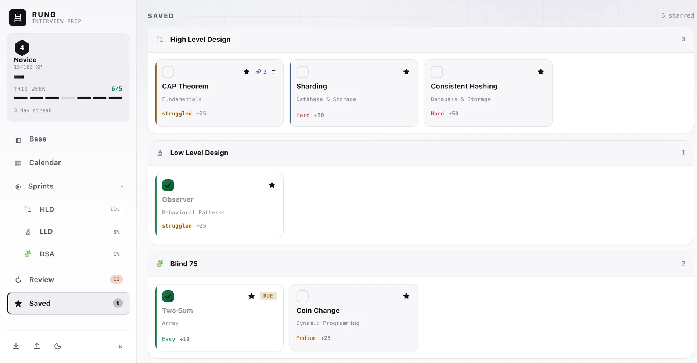

<div align="center">

# Rung

**Interview prep, one rung at a time.**

189 topics across system design and data structures. Track what you have covered,
get it back before you forget it, and plan the day you are actually going to have.

*Free · no account · no backend · works offline*

</div>



---

## What it is

Most prep trackers are a checklist. Ticking a box tells you a topic is *done* — it does not
tell you whether you would survive being asked about it six weeks later.

Rung is built around that gap. Everything you finish comes back on a spaced-repetition
ladder, so the list you keep is a list of things you can still explain. Around that sit the
parts prep actually needs: curricula you opt into, a day planner, notes and links per topic,
and a level that goes up only when you do the work.

It runs entirely in your browser. There is no sign-up, no server, and no database — your
progress lives in `localStorage` and never leaves your machine.

## The screens

### Base — what to do right now

The home screen answers one question in under a second. Your level and rank, the streak and
the week so far, what today has cost you and earned you, then everything competing for your
attention in priority order: reviews that are due, the plan you wrote for today, work you left
half-finished, and what to pick up next. Per-sprint coverage sits at the bottom.

### Sprints — pick what you are preparing for



High Level Design, Low Level Design and Blind 75 ship in the box. Join the ones you need and
leave the rest — leaving quiets a track everywhere without deleting a single topic, note or
point you earned.

### A sprint — the board



Every topic in a track, grouped by category, with its difficulty and what it is worth. Filter,
sort, bulk-edit, or click any card to open it.

### Review — remember it in six weeks, not six days



Finish something and it comes back on a ladder: 1 day, 3, 7, 14, 30, 60, 120. Recall it
cleanly and it climbs a rung. Fumble it and it drops to the bottom and returns tomorrow.
Both outcomes pay the same XP, so there is no incentive to lie to yourself.

### Calendar — a plan you actually wrote



Write on any day. A line starting with a dash becomes something you can tick off, and today's
unfinished lines follow you to the home screen. Past days shade by how much you logged; future
days show what falls due.

### Topics — everything about one idea, in one place



Notes that autosave, the blogs and videos that finally made it click, the review schedule and
the history — all behind one click, all searchable from the list and the command bar.

### Saved — star it now, find it later



Flag anything from any sprint and it collects in one place, so the ten topics you keep meaning
to redo stop getting lost among two hundred you already know.

## Run it

```bash
npm install
npm run dev      # http://localhost:5173
npm run build    # typecheck + production build into dist/
npm run preview  # serve the production build locally
```

React 19 + TypeScript + Vite. No runtime dependencies beyond React itself.

Two routes: `/` is the landing page, `/app` is the tracker. They are real paths rather than
hashes, so the host has to serve `index.html` for unknown paths — Vite does this in dev, and
`vercel.json` carries the rewrite for production.

### Deploy

Vercel auto-detects Vite — build command `npm run build`, output directory `dist`, both
detected automatically. Import the repo from the dashboard, or run `npx vercel --prod`.

> `localStorage` is scoped **per origin**. `localhost:5173` and your deployed URL each keep a
> separate copy. Pick one URL and stay on it; to migrate, Export on the old one and Import on
> the new one.

## How it works

### Sprints scope attention, never data

A sprint is a curriculum you explicitly join.

| | Scoped to joined sprints |
|---|---|
| Sidebar rows, Review queue, Base pick-up and coverage | Yes |
| Search and ⌘K | No — you can always reach anything |
| **XP, levels, calendar history** | **No — lifetime, all sprints** |

Leaving a sprint quiets it without ever costing you a level or re-locking a badge. Nothing is
deleted, and rejoining restores it instantly.

### XP and levels

XP comes from **completions and revisions only**, and every mechanic is derived from progress
you already have — never stored. The numbers cannot drift from reality, and an old backup
gains a level the moment you import it.

| Action | XP |
|---|---|
| Complete an Easy topic | +10 |
| Complete a Medium topic | +25 |
| Complete a Hard topic | +50 |
| Log a revision | +15 |

Level *L* requires `20 · (L−1) · L` cumulative XP; clearing the full catalogue lands around
level 13. Ranks run Initiate → Novice → Practitioner → Journeyman → Senior → Architect →
Distinguished. Each track unlocks at 40% of the previous one — a suggested route, not a wall.

### Streaks

A daily streak counts consecutive days with at least one completion; yesterday still counts as
alive, so opening the app before you have done anything today does not read as a broken
streak. Alongside it runs a weekly target of five days out of seven — miss a Tuesday and
nothing breaks, because the week can still land.

### Your data

- Saved synchronously on every change — closing the tab immediately after a click is safe.
- **Export** downloads `hld-lld-tracker-YYYY-MM-DD.json`. Commit it to a repo for free version history.
- **Import** restores a backup and replaces current data.
- Two open tabs stay in sync via the `storage` event.
- Clearing site data wipes it. Private windows keep it only until the window closes.
- Redeploying keeps your data: new catalogue topics are merged in, topics you deleted stay
  deleted, statuses you set are never overwritten.

## Keyboard

| Key | Action |
|---|---|
| `⌘K` / `Ctrl K` | command bar |
| `N` | new topic |
| `1`–`6` | switch views (Base, Calendar, Sprints, Review, Saved, Rewards) |
| `[` / `]` | cycle between joined sprints |
| `←` / `→` / `T` | calendar: previous month / next month / today |
| `B` | collapse / expand the sidebar |
| `J` / `K` | move the row cursor |
| `Enter` | open the focused topic |
| `X` | select the focused topic |
| `⌘Z` / `Ctrl Z` | undo the last destructive action |
| `Esc` | close dialog |

`⌘K` is both a fuzzy jump and a command bar. Type a topic name to jump straight to its detail
drawer; start with a verb and it runs as a command instead.

```
completed Parking Lot
started Kafka
add Rate Limiter to Behavioral Patterns
revised Singleton
note on CAP: PACELC is the follow-up
what should I study next
```

## The catalogue

189 seeded topics across three sprints:

| Sprint | Topics | Categories |
|---|---|---|
| High Level Design | 54 | Fundamentals, Core Components, Database & Storage, Distributed Systems, 21 HLD problems |
| Low Level Design | 60 | SOLID, Creational / Structural / Behavioral patterns, 36 LLD problems |
| Blind 75 | 75 | The classic list, grouped by pattern |

Behavioural is on the roadmap, rendered locked on the hub.

### Adding a sprint

One data file plus one registry line — no UI, navigation or CSS changes. The sprint themes
itself from its own `accent`, generates its own "clear the sprint" award, and appears on the
hub, the sidebar, the Base coverage list and ⌘K automatically.

```ts
// src/data/sprints/striver.ts
import type { SprintDef } from './types';

export const striver: SprintDef = {
  id: 'striver',                    // PERMANENT — see the warning below
  name: 'Striver DSA',
  short: 'DSA',
  tagline: 'Arrays to graphs to DP',
  icon: '🧮',
  accent: '#22d3ee',
  categories: [
    { name: 'Arrays', rank: 0, rows: [['Two Sum', 'Easy'], ['3Sum', 'Medium']] },
  ],
};
```

```ts
// src/data/sprints/index.ts
export const SPRINTS: SprintDef[] = [hld, lld, blind75, striver];
```

> **A sprint `id` is permanent.** Each topic's stable `sid` is derived as
> `` `${sprintId}|${category}|${name}` ``, and that string is how saved progress reattaches to
> the catalogue on load. Renaming an id orphans every topic in that sprint. Renaming a
> *category* or a *topic* orphans just that row. Removing a sprint file is safe: its topics
> stay in the save, are reassigned to the first registered sprint, and the id is dropped from
> `joinedSprints`.

<details>
<summary><b>Console API</b></summary>

Every command also works as `tracker.run('…')`, alongside a direct API:

```js
tracker.run('completed Parking Lot')  // plain-English command → { ok, msg, topic }
tracker.level()                       // { level, rank, xp, into, span, toNext }
tracker.sprints()                     // { registered, joined }
tracker.notes()                       // every day note
tracker.note('2026-08-22', '- do the thing')
tracker.join('lld') | tracker.leave('lld')
tracker.calendar(2026, 7)             // month grid cells (month is 0-indexed)
tracker.stats()                       // { all, hld, lld, patterns, problems, byCat, byDiff, … }
tracker.next(5)                       // ranked "study next" list
tracker.topics()                      // every topic object
tracker.data()                        // the whole persisted state
tracker.complete|start|revise|revised|reset|remove('<fuzzy name>')
tracker.add({ name, type, category, difficulty, status, notes })
tracker.move('Singleton', 'Behavioral Patterns')
tracker.reviews()                     // { due, flagged, upcoming }
tracker.review('CAP Theorem','good')  // 'good' walks the ladder, 'hard' resets it
tracker.undo()                        // reverse the last destructive action
tracker.export() | tracker.wipe()
```

</details>

<details>
<summary><b>Source layout</b></summary>

```
src/
├── main.tsx            entry
├── App.tsx             shell: tabs, shortcuts, modals, console API
├── styles/             tokens · base · layout · components · views · landing
├── types.ts            Topic / TrackerState / Stats
├── data/sprints/       the sprint registry — add a sprint here
│   ├── index.ts        SPRINTS, getSprint, resolveSprint, seedRows
│   ├── hld.ts          High Level Design — 54 topics
│   ├── lld.ts          Low Level Design — 60 topics
│   ├── blind75.ts      Blind 75 — 75 problems by pattern
│   └── teasers.ts      locked roadmap cards
├── lib/
│   ├── storage.ts      localStorage driver with in-memory fallback
│   ├── model.ts        makeTopic, blankState, non-destructive seed merge
│   ├── store.ts        external store (useSyncExternalStore) + all mutations
│   ├── stats.ts        derived progress, "study next" ranking, today's tally
│   ├── game.ts         XP, levels, ranks, skill tree
│   ├── streak.ts       daily streak and the weekly target
│   ├── srs.ts          spaced-repetition ladder, due dates, review buckets
│   ├── scope.ts        activeTopics — the single definition of "joined"
│   ├── daynotes.ts     day-note parsing + tick remapping
│   ├── calendar.ts     month grid, day detail, consistency
│   ├── commands.ts     plain-English command engine + fuzzy topic matching
│   ├── toasts.ts       toast store
│   ├── dialog.ts       themed promise-based confirm()
│   └── utils.ts        date / string / percentage helpers
├── hooks/              useFocusTrap, useReveal
├── components/         Sidebar, NavGroup, Icons, hud, SprintCard, DayNote,
│                       TopicCard, TopicDrawer, TopicModal, Palette, ConfirmDialog
└── views/              Landing, Dashboard, Calendar, Sprints, TopicsView,
                        Revision, Saved, Rewards
```

</details>

<details>
<summary><b>Regenerating the screenshots</b></summary>

The images above and on the landing page live in `public/shots/` and **go stale whenever the
UI changes**. To refresh them:

```bash
npm run dev                                                  # one shell
chrome --headless=new --remote-debugging-port=9222           # another
npm run shots -- 5173                                        # port your dev server printed
```

`scripts/shots.mjs` seeds a representative save, visits each view, captures at 2x and writes
WebP. Requires Python with Pillow for the resize step.

</details>
